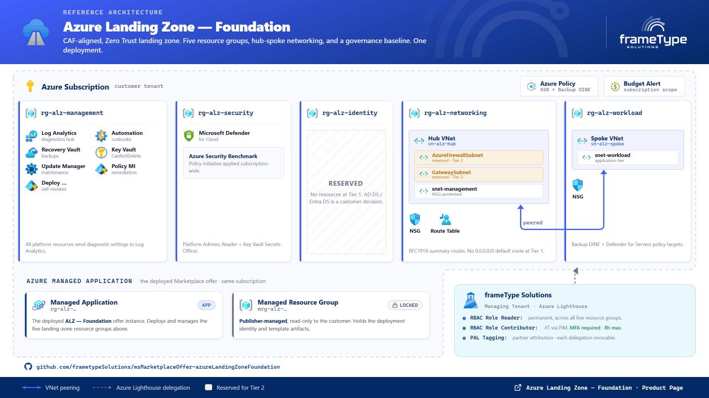

---

> **📦 Available on Microsoft Azure Marketplace**
> [Deploy Azure Landing Zone — Foundation](https://azuremarketplace.microsoft.com/en-us/marketplace/apps/frametypesolutions.azurelandingzone)

---

<!-- consumed-by: web | field: purpose -->
## 1. Purpose

Azure Landing Zone — Foundation delivers a production-grade, CAF-aligned Azure Landing Zone into a single Azure subscription through a single guided deployment experience. No scripting required beyond the included pre-deployment script. No post-deployment cleanup. Landing zone infrastructure ready on day one.

**Six outcomes. One deployment.**

1. **Five dedicated resource groups** — management, networking, security, identity, and workload — organized for clear ownership, independent RBAC, and blast radius isolation from the first deployment
2. **Hub-spoke virtual network topology** — two peered VNets with Network Security Groups (NSGs) and route tables pre-staged for Azure Firewall integration without infrastructure replacement at Tier 2
3. **Zero Trust controls baked in** — no public IPs on platform resources, outbound internet restricted to HTTPS, Key Vault protected with a `CanNotDelete` lock, and PIM-eligible JIT support access with MFA required at every activation
4. **Governance from day one** — Azure Policy assignments for backup and Defender for Servers, RBAC for two customer-defined Entra ID security groups, budget alerts with configurable thresholds, and diagnostic settings routing platform telemetry to Log Analytics — all configured at deployment time, not as a follow-up task
5. **Azure Verified Modules aligned** — the ARM JSON package is compiled from Bicep source authored in alignment with AVM standards, ensuring WAF-aligned defaults and CAF-compliant resource configuration are baked in at build time
6. **Optional managed service access via Azure Lighthouse** — read access for monitoring and JIT Contributor access (PIM-eligible, MFA required, 8-hour maximum) scoped to the five operational resource groups; no standing write access; delegation is revocable at any time

---

<!-- consumed-by: web | field: scope -->
## 2. Scope

**What this offer deploys:**

- Five Azure resource groups with consistent tagging
- Hub virtual network with `AzureFirewallSubnet`, `GatewaySubnet`, management subnet, and workload subnet
- Spoke virtual network peered to the hub
- Network Security Groups (NSGs) per subnet, with outbound internet restricted to HTTPS
- Route tables with RFC1918 summary routes pre-staged for Azure Firewall
- Log Analytics Workspace with diagnostic settings for all platform resources
- Automation Account linked to Log Analytics
- Azure Update Manager maintenance configuration targeting the workload resource group
- Recovery Services Vault with a default VM backup policy
- Azure Key Vault with `CanNotDelete` resource lock and diagnostic settings
- Microsoft Defender for Cloud — Basic (free) by default; Standard or Enhanced selectable at deployment
- Azure Security Benchmark policy assignment (subscription scope)
- Defender for Servers granular pricing policy (workload resource group scope, conditional on Defender tier)
- Backup DINE policy targeting the workload resource group
- RBAC assignments for two customer-supplied Entra ID security groups (six assignments across five resource groups)
- Resource tags on all resource groups (`environment`, `owner`, `costCenter`)
- Monthly budget alert with configurable threshold and email notification
- Azure Lighthouse delegation to frameType Solutions (five resource group delegations)

**What this offer does not include:**

- Management Group hierarchy — Tier 1 deploys into a single subscription; MG structure is a prerequisite, not deployed by this offer (see Prerequisites)
- Azure Firewall — included in Azure Landing Zone — Connected (Tier 2)
- VPN Gateway or ExpressRoute Gateway — not deployed at Tier 1
- Azure Bastion — not included; customers may add independently
- Private DNS Zones — not deployed at Tier 1; added at Tier 2 with Private Endpoint integration
- Virtual machines or workload resources — this offer deploys platform infrastructure only; workload deployment is the customer's responsibility
- Active Directory Domain Services or Entra Domain Services — `rg-alz-identity` is a placeholder; DS deployment is a customer decision

---

## 3. Table of Contents

- [1. Purpose](#1-purpose)
- [2. Scope](#2-scope)
- [3. Table of Contents](#3-table-of-contents)
- [4. Overview](#4-overview)
- [5. Azure Pricing](#5-azure-pricing)
- [6. Prerequisites](#6-prerequisites)
- [7. Deployment Steps](#7-deployment-steps)
- [8. Post-Deployment Verification](#8-post-deployment-verification)
- [9. Zero Trust Alignment](#9-zero-trust-alignment)
- [10. Azure Governance](#10-azure-governance)
- [11. Naming Conventions](#11-naming-conventions)
- [12. Identity and RBAC](#12-identity-and-rbac)
- [13. Managed Service Access](#13-managed-service-access)
- [14. Troubleshooting](#14-troubleshooting)
- [15. Upgrade Path](#15-upgrade-path)
- [16. Conclusion](#16-conclusion)
- [17. References](#17-references)

---

## 4. Overview



Azure Landing Zone — Foundation organizes landing zone resources across five resource groups. The hub-spoke networking topology isolates platform infrastructure from workloads while enabling peered connectivity. All platform resources route telemetry to a central Log Analytics Workspace from deployment.

### Deployment Layers

| Layer | Purpose | Key resources |
|---|---|---|
| **Management** | Platform observability and operations | Log Analytics Workspace, Automation Account, Azure Update Manager, Recovery Services Vault, Key Vault |
| **Networking** | Hub VNet, segmentation, and routing | Hub VNet, NSG, route table, subnet layout pre-staged for Azure Firewall |
| **Security** | Posture management and secrets | Defender for Cloud, Azure Security Benchmark policy, Key Vault (also in management layer for ops) |
| **Identity** | Identity infrastructure placeholder | `rg-alz-identity` reserved; no resources deployed at Tier 1 |
| **Workload** | Customer workload landing zone | Spoke VNet, NSG, peering to hub; backup and Defender policies target this RG |

### Deployed Resources

| Resource | Type | Resource group | Notes |
|---|---|---|---|
| `law-alz-{env}-{region}-01` | Log Analytics Workspace | `rg-alz-management` | Central diagnostic sink; 30-day default retention |
| `aa-alz-{env}-{region}-01` | Automation Account | `rg-alz-management` | Linked to Log Analytics |
| `mc-alz-{env}-{region}-01` | Maintenance Configuration | `rg-alz-management` | Update Manager daily patch schedule targeting workload RG |
| `rsv-alz-{env}-{region}-01` | Recovery Services Vault | `rg-alz-management` | Default VM backup policy; geo-redundant; soft delete enabled |
| `kv-alz-{env}-{region}-01` | Key Vault | `rg-alz-management` | `CanNotDelete` lock; diagnostic settings to Log Analytics |
| `id-alz-deployScript-{env}-{region}` | User-Assigned Managed Identity | `mrg-*` (managed RG) | Deployment execution identity; self-revokes Owner after deployment |
| `vn-alz-hub-{env}-{region}-{cidr}` | Virtual Network (hub) | `rg-alz-networking` | RFC1918 /16 default; `AzureFirewallSubnet`, `GatewaySubnet`, management subnet |
| `nsg-alz-{env}-{region}-management` | Network Security Group | `rg-alz-networking` | Per-subnet; outbound HTTP (80) to internet blocked |
| `rt-alz-{env}-{region}-management` | Route Table | `rg-alz-networking` | RFC1918 summary routes; no `0.0.0.0/0` default route at Tier 1 |
| `vn-alz-spoke-{env}-{region}-{cidr}` | Virtual Network (spoke) | `rg-alz-workload` | RFC1918 /16 default; peered to hub |
| `nsg-alz-{env}-{region}-workload` | Network Security Group | `rg-alz-workload` | Workload subnet NSG |
| `budget-forge-lz-monthly` | Budget | Subscription | Configurable threshold; alerts at 80% actual and 100% forecast |
| Policy — Azure Security Benchmark | Policy Assignment | Subscription | Built-in initiative; always assigned |
| Policy — Defender for Servers | Policy Assignment | `rg-alz-workload` scope | Conditional; assigned when Standard or Enhanced Defender tier selected |
| Policy — Backup DINE | Policy Assignment | Subscription | Auto-configures backup for VMs in workload RG |
| `id-alz-policyRemediation-{env}-{region}` | User-Assigned Managed Identity | `rg-alz-management` | Policy remediation identity; Security Admin at subscription scope |
| Lighthouse Registration Definition | Lighthouse | Subscription | frameType Solutions managing tenant |
| 5x Lighthouse Registration Assignments | Lighthouse | Per operational RG | One delegation per resource group |

### Networking Detail

The hub VNet is deployed into `rg-alz-networking`. The spoke VNet is deployed into `rg-alz-workload`. Hub-spoke peering is bidirectional and configured at deployment time.

Route tables are deployed with RFC1918 summary routes (`10.0.0.0/8`, `172.16.0.0/12`, `192.168.0.0/16`) and a `VnetLocal` next hop. There is no `0.0.0.0/0` default route at Tier 1 — internet-bound traffic follows the Azure system default route until Forge Connect introduces Azure Firewall and populates the default route without replacing existing infrastructure.

### Management Detail

All platform resources route diagnostic logs and metrics to the central Log Analytics Workspace. The Recovery Services Vault has soft delete enabled and a default backup policy — no protected instances are created until the customer onboards their VM workloads. The Automation Account is linked to Log Analytics and available for customer runbook use.

### Security Detail

Microsoft Defender for Cloud is deployed at the tier selected in the guided deployment experience. Basic is the default (free). Standard and Enhanced tiers add threat detection for server workloads via Defender for Servers. The Azure Security Benchmark policy initiative is always assigned at subscription scope, providing Secure Score population, regulatory compliance dashboard, and WAF-aligned configuration recommendations from day one.

---

## 5. Azure Pricing

Azure Landing Zone — Foundation is a Marketplace managed application with a monthly subscription fee. Azure resource costs are billed directly to your subscription and are additional to the Marketplace fee.

**Marketplace subscription fee:** $124/month — covers frameType Solutions managed service access (monitoring and JIT support via Lighthouse delegation).

**Azure resource cost estimates** (approximate; varies by region, log volume, and usage):

| Resource | Estimated monthly cost | Notes |
|---|---|---|
| Log Analytics Workspace | $2.30–$5.00/GB ingested | Platform telemetry only at Tier 1; typical ingestion is low |
| Automation Account | ~$0 | Free tier covers typical platform automation use (500 min/month) |
| Recovery Services Vault | $0 at deployment | Backup storage costs begin when VM workloads are protected |
| Azure Update Manager | $0 | No charge for Azure VMs |
| Key Vault | ~$0.03 per 10,000 operations | Minimal at platform-only usage |
| VNets and peering | ~$1–$5/month | Intra-region peering at $0.01/GB data processed; volume-dependent |
| NSGs and route tables | $0 | No hourly or compute charge |
| Budget alert | $0 | Azure Cost Management feature — no charge |
| Defender for Cloud — Basic | $0 | Free CSPM tier; default selection |
| Defender for Cloud — Standard | Per protected server | See Defender for Cloud pricing page |
| Defender for Cloud — Enhanced | Per protected server | See Defender for Cloud pricing page |

Estimate your total costs using the [Azure Pricing Calculator](https://azure.microsoft.com/en-us/pricing/calculator/).

For Defender for Cloud pricing detail, refer to the [Defender for Cloud pricing page](https://azure.microsoft.com/en-us/pricing/details/defender-for-cloud/).

---

## 6. Prerequisites

Complete all of the following before beginning the guided deployment experience.

| Prerequisite | Requirement | Notes |
|---|---|---|
| Azure subscription | Dedicated subscription recommended | Deploy into a new or purpose-provisioned subscription. Tier 1 deploys at subscription scope. Mixing platform and workload resources in an existing subscription creates a refactor problem at Tier 2. |
| Subscription Owner | Owner role on the target subscription | Required for Lighthouse delegation and RBAC assignments. Contributor is not sufficient. |
| Entra ID permissions | Global Administrator, Groups Administrator, or User Administrator | Required to run the pre-deployment script and create Entra ID security groups. |
| PowerShell 7+ | PowerShell 7 or later | Required to execute `alzPreDeployment.ps1`. [Download PowerShell](https://aka.ms/install-powershell) |
| Azure CLI | Current release | Required by the pre-deployment script for group creation and Object ID retrieval. [Download Azure CLI](https://aka.ms/installazurecli) |
| Address space planning | Two non-overlapping RFC1918 /16 CIDR blocks | One for the hub VNet, one for the spoke VNet. Defaults: `10.0.0.0/16` (hub), `10.10.0.0/16` (spoke). Ensure no overlap with existing on-premises or VNet ranges if hybrid connectivity is planned. |
| Marketplace access | Azure Marketplace enabled on the target subscription | The deploying account must be able to purchase from Azure Marketplace in the target subscription. Verify in the Azure portal under **Marketplace settings**. |
| Two Entra ID group Object IDs | Provided by the pre-deployment script | The guided deployment experience requires the Object IDs of the Platform Admins and Workload Admins groups on the Identity and Access step. The script creates these groups and displays the IDs ready to paste. |

---

## 7. Deployment Steps

```
Step 1 — Run pre-deployment script   →   Step 2 — Deploy from Marketplace   →   Step 3 — Verify
```

---

### Step 1 — Run the Pre-Deployment Script

> **Required before opening the guided deployment experience.**
> The deployment wizard requires the Object IDs of two Entra ID security groups on the Identity and Access step. These groups must exist before you begin.

**Download** `alzPreDeployment.ps1` from the [frameType Solutions GitHub repository](https://github.com/frametypeSolutions/msMarketplaceOffer-azureLandingZoneFoundation).

The script:

1. Connects to your Azure tenant
2. Creates (or retrieves if they already exist) two Entra ID security groups: `Platform Admins` and `Workload Admins`
3. Registers required Azure resource providers on the target subscription
4. Grants the Marketplace-created managed identity the permissions needed to execute deployment scripts within the target subscription
5. Displays the Object ID of each group — **copy these values before closing the terminal**

```powershell
# Run from PowerShell 7+
./alzPreDeployment.ps1 -TenantId "<your-tenant-id>" -SubscriptionId "<your-subscription-id>"
```

The script is signed with Azure Trusted Signing (`acs-frametypesol-prod-01`). If execution policy blocks the script, run:

```powershell
Set-ExecutionPolicy -ExecutionPolicy RemoteSigned -Scope CurrentUser
```

---

### Step 2 — Deploy from Azure Marketplace

1. Navigate to the [Deploy Azure Landing Zone — Foundation](https://azuremarketplace.microsoft.com/en-us/marketplace/apps/frametypesolutions.azurelandingzone) listing on Azure Marketplace
2. Click **Get it now** and select the **Azure Landing Zone — Foundation** plan
3. Complete the guided deployment experience:

| Step | Fields | Notes |
|---|---|---|
| **Basics** | Subscription, region, resource group prefix, environment | Select the dedicated subscription. Choose your Azure region. |
| **Networking** | Hub VNet CIDR, spoke VNet CIDR | Defaults: `10.0.0.0/16` and `10.10.0.0/16`. Change if overlap exists. |
| **Security** | Defender for Cloud tier | Basic (default, free), Standard, or Enhanced. |
| **Identity and Access** | Platform Admins Object ID, Workload Admins Object ID | Paste the Object IDs from Step 1. |
| **Budget** | Budget amount (monthly), alert email address | Configurable threshold; alerts sent at 80% actual and 100% forecast. |
| **Managed Service Access** | Lighthouse delegation toggle | Enabled by default. Provides frameType Solutions read and JIT support access. Disabling removes Lighthouse delegation from the deployment. |
| **Review + create** | Review all selections | Validate, then click **Create**. |

4. Deployment runs as a Marketplace managed application. The guided deployment experience creates a managed resource group (`mrg-*`) containing deployment infrastructure. All operational resources are deployed into the five named resource groups.

---

### Step 3 — Verify and Onboard Users

Complete post-deployment verification per [Section 8](#8-post-deployment-verification), then add members to the two Entra ID security groups created by the pre-deployment script.

---

## 8. Post-Deployment Verification

Complete these steps after deployment reports **Succeeded** in the Azure portal.

**Step 1 — Confirm resource groups**

Navigate to **Azure Portal → Resource groups**. Confirm all five resource groups exist with `Succeeded` provisioning state:

- `rg-alz-management-{environment}-{region}-01`
- `rg-alz-networking-{environment}-{region}-01`
- `rg-alz-security-{environment}-{region}-01`
- `rg-alz-identity-{environment}-{region}-01`
- `rg-alz-workload-{environment}-{region}-01`

**Step 2 — Verify Lighthouse delegation**

Navigate to **Azure Portal → Azure Lighthouse → Service providers → Service provider offers**. The offer should appear as `frameType Solutions: ALZ Foundation — {workload}-{environment}` (where `{workload}` and `{environment}` match the values entered at deployment time) with five active resource group delegations.

If delegations are missing after 30 minutes, check the `deploymentScript` resource in the managed resource group (`mrg-*`) under **Deployments** for errors. Contact [support@frametypesolutions.com](mailto:support@frametypesolutions.com) if errors persist.

**Step 3 — Verify RBAC assignments**

Navigate to each resource group → **Access control (IAM) → Role assignments**. Confirm the following assignments are present:

| Group | Role | Resource group |
|---|---|---|
| Platform Admins | Reader | `rg-alz-management` |
| Platform Admins | Reader | `rg-alz-networking` |
| Platform Admins | Reader | `rg-alz-security` |
| Platform Admins | Key Vault Secrets Officer | `rg-alz-security` |
| Workload Admins | Contributor | `rg-alz-workload` |
| Workload Admins | Key Vault Reader | `rg-alz-security` |

**Step 4 — Review Defender for Cloud recommendations**

Navigate to **Azure Portal → Microsoft Defender for Cloud → Recommendations**. The Azure Security Benchmark policy begins evaluating your environment shortly after deployment. Initial results may take 15–30 minutes to populate. Review high-severity recommendations and address those relevant to your workload plans.

**Step 5 — Add members to Entra ID security groups**

RBAC roles have been assigned to the groups automatically. Users are not added by the deployment — this is intentional to preserve least-privilege control.

Navigate to **Azure Portal → Microsoft Entra ID → Groups → [select group] → Members → Add members**. Repeat for both Platform Admins and Workload Admins groups.

**Step 6 — Confirm budget alert**

Navigate to **Azure Portal → Cost Management → Budgets**. Confirm `budget-forge-lz-monthly` is present with your configured threshold and alert email.

---

## 9. Zero Trust Alignment

<!-- consumed-by: web | field: zeroTrust -->
Azure Landing Zone — Foundation is designed around Microsoft's Zero Trust security principles. Every architectural decision maps to one or more of the three core principles: **Verify Explicitly**, **Use Least Privilege**, and **Assume Breach**.

| Principle | Implementation |
|---|---|
| **Verify Explicitly** | All access to landing zone resources is governed by Entra ID group membership and Azure RBAC — no shared credentials, no standing write access outside defined roles. Lighthouse MFA is required at every PIM activation before write access is granted. Defender for Cloud continuously evaluates configuration against the Azure Security Benchmark policy. |
| **Use Least Privilege** | Platform Admins receive Reader only on infrastructure resource groups — no write capability. Workload Admins receive Contributor on the workload RG only — not subscription-wide. Key Vault access is split: Secrets Officer for the platform team (management plane), Reader for the workload team (data plane retrieval only). The policy remediation managed identity is a dedicated, separate identity with Security Admin scoped to subscription — not a general-purpose identity. frameType's Lighthouse Reader group has permanent Reader only (passive visibility). frameType's Lighthouse Engineers group is PIM-eligible Contributor — JIT activation, MFA required, 8-hour maximum per session. |
| **Assume Breach** | NSG rules block outbound HTTP (port 80) to the internet; HTTPS (443) is permitted for Azure service communication. No public IPs are assigned to any platform resource. Key Vault is protected with a `CanNotDelete` resource lock. Lighthouse delegations are per resource group and independently revocable. Diagnostic settings route events for all platform resources to Log Analytics from the first deployment. Defender for Cloud provides continuous security posture assessment and Secure Score tracking. |

### Zero Trust and Networking

- **No default internet route at Tier 1** — route tables deploy with RFC1918 summary routes and `VnetLocal` next hop; there is no `0.0.0.0/0` route pointing to the internet
- **Outbound restriction** — NSG rules block outbound HTTP (port 80) to the internet; HTTPS (port 443) is permitted for Azure service communication
- **Subnet segmentation** — hub and spoke VNets are isolated and peered; east-west traffic between subnets is controllable via NSG rules without topology changes
- **Upgrade-ready** — Forge Connect adds Azure Firewall and populates the default route; no routing infrastructure is replaced at upgrade

### Zero Trust and Identity

- **No standing write access** — frameType engineers must PIM-activate their Lighthouse role for each support engagement; all activations appear in the customer's Azure Activity Log
- **Customer group ownership** — Platform Admins and Workload Admins groups are in the customer's own Entra ID tenant; the customer owns and controls group membership throughout
- **Separation of duties** — policy remediation and deployment execution use distinct managed identities with separate, narrowly scoped permissions

For Microsoft's Zero Trust reference architecture for Azure infrastructure, refer to: [Zero Trust guidance for Azure IaaS](https://learn.microsoft.com/en-us/security/zero-trust/azure-infrastructure-overview)

---

## 10. Azure Governance

Azure Landing Zone — Foundation follows [CAF naming conventions](https://learn.microsoft.com/en-us/azure/cloud-adoption-framework/ready/azure-best-practices/resource-naming) and tagging practices across all deployed resources.

### Tagging

The following tags are applied to all resource groups at deployment time:

| Tag | Source | Purpose |
|---|---|---|
| `environment` | Guided deployment experience input | Environment classification (prod, dev, test, infra) |
| `owner` | Guided deployment experience input | Ownership contact or team name |
| `costCenter` | Guided deployment experience input | Cost attribution for financial reporting |

Tags are applied at resource group level and propagate to resources via Azure Policy inheritance where configured.

### Azure Policy

| Policy | Scope | Effect | Condition |
|---|---|---|---|
| Azure Security Benchmark initiative | Subscription | Audit / DeployIfNotExists | Always assigned |
| Backup DINE policy | Subscription | DeployIfNotExists | Always assigned; targets `rg-alz-workload` VMs |
| Defender for Servers granular pricing | `rg-alz-workload` scope | DeployIfNotExists | Conditional — assigned when Standard or Enhanced Defender tier selected |

RBAC assignments are scoped to the minimum required resource group level — no subscription-wide Owner or Contributor roles are assigned to customer accounts by this offer.

### Well-Architected Framework Alignment

The offer is designed in alignment with the five WAF pillars:

- **Reliability** — Recovery Services Vault, Update Manager, and geo-redundant storage options
- **Security** — Zero Trust controls, Defender for Cloud, Azure Policy, Key Vault, and Lighthouse with JIT access
- **Cost Optimization** — budget alerts, Basic Defender by default, free tier services where appropriate
- **Operational Excellence** — Log Analytics from deployment, tagging, and policy-driven automation
- **Performance Efficiency** — hub-spoke topology scalable to Forge Connect without infrastructure replacement

For more on the Well-Architected Framework, refer to: [Azure Well-Architected Framework](https://learn.microsoft.com/en-us/azure/well-architected/)

---

## 11. Naming Conventions

All resources follow the [CAF recommended naming convention](https://learn.microsoft.com/en-us/azure/cloud-adoption-framework/ready/azure-best-practices/resource-naming):

```
{resource-type}-{workload}-{qualifier}-{environment}-{region}-{instance}
```

| Token | Value | Notes |
|---|---|---|
| `{resource-type}` | CAF abbreviation | `rg`, `vnet`, `nsg`, `kv`, `law`, `aa`, etc. |
| `{workload}` | `alz` | Hardcoded — represents the offer identity |
| `{qualifier}` | Descriptive (where used) | `hub`, `spoke`, `management`, `workload` — applied where discriminator is needed |
| `{environment}` | Guided deployment input | `prod`, `dev`, `test`, `infra` |
| `{region}` | Full Azure region name | `eastus`, `westus2`, `australiaeast` — full name per CAF standard |
| `{instance}` | Zero-padded sequence | `01` |

**Naming examples:**

| Resource | Example name |
|---|---|
| Management resource group | `rg-alz-management-prod-eastus-01` |
| Networking resource group | `rg-alz-networking-prod-eastus-01` |
| Log Analytics Workspace | `law-alz-prod-eastus-01` |
| Key Vault | `kv-alz-prod-eastus-01` |
| Automation Account | `aa-alz-prod-eastus-01` |
| Hub VNet | `vn-alz-hub-prod-eastus-10.0` |
| Spoke VNet | `vn-alz-spoke-prod-eastus-10.10` |
| Hub NSG | `nsg-alz-prod-eastus-management` |
| Route table | `rt-alz-prod-eastus-management` |
| Recovery Services Vault | `rsv-alz-prod-eastus-01` |

> VNet and related resources use the first two octets of the address space as the instance discriminator (e.g., `10.0`, `10.10`) in place of the sequential `01` suffix, making the address space visible in the resource name and avoiding collision in multi-VNet environments.

---

## 12. Identity and RBAC

### Customer Identity

Two Entra ID security groups are created by the pre-deployment script and supplied to the guided deployment experience. RBAC roles are assigned to these groups at deployment time.

| Principal | Type | Scope | Role | Notes |
|---|---|---|---|---|
| Platform Admins | Customer Entra ID group | `rg-alz-management` | Reader | Visibility into management resources |
| Platform Admins | Customer Entra ID group | `rg-alz-networking` | Reader | Visibility into networking resources |
| Platform Admins | Customer Entra ID group | `rg-alz-security` | Reader | Visibility into security resources |
| Platform Admins | Customer Entra ID group | `rg-alz-security` | Key Vault Secrets Officer | Management plane access to Key Vault |
| Workload Admins | Customer Entra ID group | `rg-alz-workload` | Contributor | Deploy and manage workload resources |
| Workload Admins | Customer Entra ID group | `rg-alz-security` | Key Vault Reader | Data plane read access to Key Vault secrets |

### Deployment and Remediation Identities

| Principal | Type | Scope | Role | Lifecycle |
|---|---|---|---|---|
| `id-alz-deployScript-{env}-{region}` | User-assigned managed identity | Subscription | Owner (temporary) | Created in managed RG; self-revokes Owner role assignment on completion; persists inert in managed RG |
| `id-alz-policyRemediation-{env}-{region}` | User-assigned managed identity | Subscription | Security Admin | Created in `rg-alz-management`; used by Azure Policy remediation tasks |

### frameType Solutions — Lighthouse Identity

| Principal | Type | Scope | Role | Mechanism |
|---|---|---|---|---|
| `lighthouseReaders` | frameType Entra ID group | Five operational RGs | Reader | Permanent — passive monitoring visibility |
| `lighthouseEngineers` | frameType Entra ID group | Five operational RGs | Contributor (PIM-eligible) | JIT only — MFA required, 8-hour maximum, every activation logged |

All frameType Lighthouse access is scoped to the five operational resource groups. No access is delegated at subscription scope or above. Delegations are independently revocable per resource group.

---

## 13. Managed Service Access

Azure Landing Zone — Foundation includes Azure Lighthouse delegation to frameType Solutions as part of the offer. The monthly subscription fee of $124 covers this managed service access.

### Access Model

| Access type | Mechanism | Scope | Duration |
|---|---|---|---|
| Monitoring (read) | Permanent Reader via Lighthouse | Five operational resource groups | Persistent while delegation active |
| Support and operations (write) | PIM-eligible Contributor via Lighthouse | Five operational resource groups | JIT — MFA required; maximum 8 hours per activation |

### What frameType Can Access

frameType Solutions can access resources within the five operational resource groups: `rg-alz-management`, `rg-alz-networking`, `rg-alz-security`, `rg-alz-identity`, and `rg-alz-workload`.

frameType has no access to the managed resource group (`mrg-*`) contents after deployment, no access to other subscriptions in your tenant, and no standing write access to any resource.

### What frameType Cannot Access

- Resources outside the five operational resource groups
- Other subscriptions or management groups in your tenant
- Your Entra ID directory
- Key Vault secrets (data plane) — the frameType Lighthouse Reader role is Reader only; Key Vault Secrets Officer is assigned to your Platform Admins group, not to frameType

### Revoking Access

Lighthouse delegation is revocable at any time without impact to deployed resources. To remove a delegation:

1. Navigate to **Azure Portal → Azure Lighthouse → Service providers → Service provider offers**
2. Select the Azure Landing Zone — Foundation delegation
3. Click **Delete** on the specific resource group delegation to revoke selectively, or delete all five to remove frameType access entirely

Revoking Lighthouse delegation does not remove or affect any deployed resources. It only removes frameType's ability to view or access those resource groups.

---

## 14. Troubleshooting

### Pre-Deployment Script Fails — Insufficient Permissions

**Symptom:** The script reports an error creating Entra ID groups or fails to complete provider registration.

**Resolution:** Confirm the account running the script holds Global Administrator, Groups Administrator, or User Administrator in the target Entra ID tenant. Confirm the account holds Owner on the target subscription for provider registration. Re-run the script after correcting the role.

### Deployment Fails — Owner Role Not Propagated

**Symptom:** The deploymentScript resource in the managed resource group (`mrg-*`) reports a failure related to role assignment propagation.

**Resolution:** Azure RBAC role assignments can take up to five minutes to propagate after assignment. The managed identity requires Owner at subscription scope to execute the nested deployment. If the deployment fails within the first few minutes, wait five minutes and redeploy. If the failure persists, check the deploymentScript logs in the managed resource group under **Deployments**.

### Lighthouse Delegations Missing After Deployment

**Symptom:** The offer deployed successfully but Azure Lighthouse shows no active delegations under Service provider offers.

**Resolution:** Lighthouse registration assignments are deployed as part of the nested subscription-scoped deployment. Allow up to 30 minutes for delegations to propagate and appear in the Lighthouse blade. If delegations are still absent after 30 minutes, navigate to the managed resource group → **Deployments** and check the `deploy-lighthouse` and `deploy-lighthouseAssignment-*` deployment records for errors. Contact [support@frametypesolutions.com](mailto:support@frametypesolutions.com) if errors are present.

### RBAC Assignments Missing

**Symptom:** One or more role assignments are not visible in the expected resource group after deployment.

**Resolution:** RBAC assignments can take several minutes to appear in the portal after a successful deployment. Refresh the Access control (IAM) blade after five minutes. Confirm the Object IDs entered in the guided deployment experience match the groups created by the pre-deployment script — a mismatched Object ID results in an assignment to a non-existent principal, which is valid ARM but invisible in the portal. Re-run the script to retrieve the correct Object IDs and verify.

### Defender for Cloud Recommendations Not Populating

**Symptom:** The Microsoft Defender for Cloud Recommendations blade shows no results shortly after deployment.

**Resolution:** Initial evaluation against the Azure Security Benchmark policy takes 15–30 minutes after deployment. This is expected behavior. Return to the Recommendations blade after 30 minutes. If no recommendations appear after an hour, navigate to **Defender for Cloud → Environment settings** and confirm the Azure Security Benchmark initiative is assigned to the subscription.

### Key Vault Deployment Fails on Redeploy — Soft Delete Conflict

**Symptom:** A redeployment (after a teardown) fails with a conflict on Key Vault creation, reporting the vault name is already taken or in a deleted state.

**Resolution:** Azure Key Vault soft delete is enabled by default and retains deleted vaults for 90 days. To resolve: navigate to **Azure Portal → Key Vault → Manage deleted vaults**, select the vault, and click **Purge**. Alternatively, use the Azure CLI: `az keyvault purge --name <vault-name> --location <region>`. After purging, redeploy.

---

## 15. Upgrade Path

Azure Landing Zone — Foundation is Tier 1 of a three-tier Azure Landing Zone suite. The hub-spoke topology, route table structure, and subnet layout are designed for forward compatibility at every tier.

| Tier | Offer | What it adds | Upgrade model |
|---|---|---|---|
| **Tier 1** | Azure Landing Zone — Foundation *(this offer)* | Five resource groups, hub-spoke networking, governance, RBAC, Lighthouse, Defender for Cloud | Foundation — deploy first |
| **Tier 2** | Azure Landing Zone — Connected *(coming soon)* | Azure Firewall, default route, Private DNS Zones, multi-subscription peering, VPN or ExpressRoute gateway options | Extends Tier 1 — no infrastructure replacement |
| **Tier 3** | Azure Landing Zone — Enterprise *(coming soon)* | Management Group hierarchy, enterprise-scale governance, multiple landing zone subscriptions, Policy at MG scope | Extends Tier 2 — structural expansion |

**No rebuilding required.** The route tables deployed at Tier 1 are pre-staged to receive the Azure Firewall default route at Tier 2. The `AzureFirewallSubnet` in the hub VNet is sized and ready. Tier 2 adds infrastructure; it does not replace what Tier 1 deployed.

Customers running Azure Firewall independently can engage frameType Solutions for a deployment review and upgrade path assessment. See [frametypesolutions.com](https://frametypesolutions.com) for professional services options.

---

## 16. Conclusion

Azure Landing Zone — Foundation delivers a complete, production-grade Azure Landing Zone foundation in a single guided deployment — CAF-aligned, Zero Trust by design, and built for forward compatibility with the Azure Landing Zone suite. Five resource groups, hub-spoke networking, governance controls, and managed service access are all configured at deployment time, not as follow-on tasks.

For support, questions, or professional services engagements, contact [support@frametypesolutions.com](mailto:support@frametypesolutions.com) or visit the [frameType Solutions product page](https://frametypesolutions.com/marketplace/alz-foundation).

---

## 17. References

| Resource | Link |
|---|---|
| Azure Landing Zone — CAF guidance | [https://learn.microsoft.com/en-us/azure/cloud-adoption-framework/ready/landing-zone/](https://learn.microsoft.com/en-us/azure/cloud-adoption-framework/ready/landing-zone/) |
| CAF naming convention | [https://learn.microsoft.com/en-us/azure/cloud-adoption-framework/ready/azure-best-practices/resource-naming](https://learn.microsoft.com/en-us/azure/cloud-adoption-framework/ready/azure-best-practices/resource-naming) |
| CAF tagging strategy | [https://learn.microsoft.com/en-us/azure/cloud-adoption-framework/ready/azure-best-practices/resource-tagging](https://learn.microsoft.com/en-us/azure/cloud-adoption-framework/ready/azure-best-practices/resource-tagging) |
| Azure Well-Architected Framework | [https://learn.microsoft.com/en-us/azure/well-architected/](https://learn.microsoft.com/en-us/azure/well-architected/) |
| Zero Trust guidance for Azure IaaS | [https://learn.microsoft.com/en-us/security/zero-trust/azure-infrastructure-overview](https://learn.microsoft.com/en-us/security/zero-trust/azure-infrastructure-overview) |
| Azure Lighthouse documentation | [https://learn.microsoft.com/en-us/azure/lighthouse/overview](https://learn.microsoft.com/en-us/azure/lighthouse/overview) |
| Azure Privileged Identity Management | [https://learn.microsoft.com/en-us/azure/active-directory/privileged-identity-management/pim-configure](https://learn.microsoft.com/en-us/azure/active-directory/privileged-identity-management/pim-configure) |
| Microsoft Defender for Cloud | [https://learn.microsoft.com/en-us/azure/defender-for-cloud/defender-for-cloud-introduction](https://learn.microsoft.com/en-us/azure/defender-for-cloud/defender-for-cloud-introduction) |
| Azure Security Benchmark | [https://learn.microsoft.com/en-us/security/benchmark/azure/introduction](https://learn.microsoft.com/en-us/security/benchmark/azure/introduction) |
| Azure Policy — DINE effect | [https://learn.microsoft.com/en-us/azure/governance/policy/concepts/effect-deploy-if-not-exists](https://learn.microsoft.com/en-us/azure/governance/policy/concepts/effect-deploy-if-not-exists) |
| Azure Update Manager | [https://learn.microsoft.com/en-us/azure/update-manager/overview](https://learn.microsoft.com/en-us/azure/update-manager/overview) |
| Azure Verified Modules | [https://azure.github.io/Azure-Verified-Modules/](https://azure.github.io/Azure-Verified-Modules/) |
| Marketplace managed applications | [https://learn.microsoft.com/en-us/azure/azure-resource-manager/managed-applications/overview](https://learn.microsoft.com/en-us/azure/azure-resource-manager/managed-applications/overview) |
| Azure Pricing Calculator | [https://azure.microsoft.com/en-us/pricing/calculator/](https://azure.microsoft.com/en-us/pricing/calculator/) |
| frameType Solutions product page | [https://frametypesolutions.com/marketplace/alz-foundation](https://frametypesolutions.com/marketplace/alz-foundation) |
| frameType Solutions GitHub | [https://github.com/frametypeSolutions/msMarketplaceOffer-azureLandingZoneFoundation](https://github.com/frametypeSolutions/msMarketplaceOffer-azureLandingZoneFoundation) |

---

Version 1.0 | frameType Solutions | June 2026
